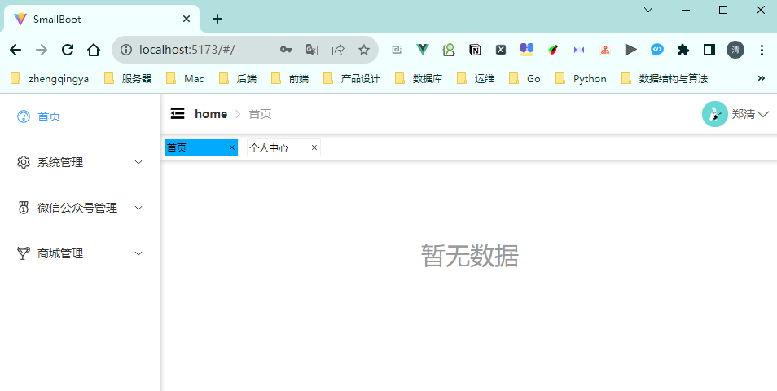

# 页面布局



[src/App.vue](../src/App.vue)

```
<template>
  <!-- 路由出口 -->
  <!-- 路由匹配到的组件将渲染在这里 -->
  <!-- <router-view /> -->
  <layout />
</template>
<script setup>
import layout from '@/layout/index.vue';
</script>
```

[src/layout/index.vue](../src/layout/index.vue)

```
<template>
  <!-- <h1>{{ route.meta }}</h1> -->
  <div v-show="isLogin && !$route.meta.isParentView" class="flex h100 w100">
    <!-- 侧边栏菜单 -->
    <sidebar v-if="isShowMenu" id="sidebar" class="w-200" />
    <div class="flex-1">
      <div id="top">
        <!-- 顶部导航栏 -->
        <navbar class="h-50" />
        <!-- Tabs标签页 -->
        <div :style="{ width: appMainWidth + 'px' }">
          <tabs-view />
        </div>
      </div>
      <!-- 主页面 -->
      <div :style="{ height: appMainHeight + 'px', width: appMainWidth + 'px' }">
        <app-main class="app-main p-10" />
      </div>
    </div>
  </div>
  <div v-if="!isLogin || (isLogin && $route.meta.isParentView)" class="h100">
    <router-view />
  </div>
</template>

<script setup>
import sidebar from './components/sidebar.vue';
import navbar from './components/navbar.vue';
import appMain from './components/app-main.vue';
import tabsView from './components/tabs-view.vue';
const { proxy } = getCurrentInstance();
let { isLogin } = toRefs(proxy.$store.user.useUserStore());
let { isShowMenu } = toRefs(proxy.$store.settings.useSettingsStore());
let appMainWidth = ref(0);
let appMainHeight = ref(0);

onMounted(() => {
  // 窗口宽高变化时触发 -- tips：window.onresize只能在项目内触发1次
  window.onresize = function windowResize() {
    calWidthAndHeight();
  };
});

// 注册一个回调函数，在组件因为响应式状态变更而更新其 DOM 树之后调用。
onUpdated(() => {
  calWidthAndHeight();
});

watch(
  [isLogin, isShowMenu],
  (newValue) => {
    calWidthAndHeight();
  },
  { immediate: false, deep: true },
);

function calWidthAndHeight() {
  let sidebarW = document.getElementById('sidebar').offsetWidth;
  appMainWidth.value = window.innerWidth - sidebarW;

  let topH = document.getElementById('top').offsetHeight;
  appMainHeight.value = window.innerHeight - topH - 20; // 20 指 p-10
}
</script>
<style lang="scss" scoped>
.app-main {
  // height: calc(100vh - 50px); // 满屏 - navbar
}
</style>
```

[src/layout/components/app-main.vue](../src/layout/components/app-main.vue)

```
<template>
  <el-scrollbar>
    <!-- 路由视图 -->
    <router-view />
  </el-scrollbar>
</template>
<script setup></script>
<style lang="scss" scoped></style>
```

[src/layout/components/navbar.vue](../src/layout/components/navbar.vue)

```
<template>
  <!-- {{ route.meta }} -->
  <div class="app flex-between-center p-x-10">
    <div class="flex-center-center">
      <div class="m-r-10" style="cursor: pointer" @click="proxy.$store.settings.useSettingsStore().update">
        <el-icon :size="22">
          <component :is="proxy.$store.settings.useSettingsStore().isShowMenu ? 'Fold' : 'Expand'" />
        </el-icon>
      </div>

      <el-breadcrumb :separator-icon="ArrowRight">
        <el-breadcrumb-item :to="{ path: '/' }">home</el-breadcrumb-item>
        <el-breadcrumb-item v-for="item in route.meta.breadcrumbItemList" :key="item">
          <span class="text-color-grey">{{ item }}</span>
        </el-breadcrumb-item>
      </el-breadcrumb>
    </div>

    <wx-mp-account />

    <el-dropdown class="avatar-container right-menu-item hover-effect" trigger="click">
      <div class="flex-center-center">
        <el-avatar class="" :size="32" :src="userObj.avatarUrl" />
        <div class="flex-center-center">
          <span class="m-l-5"> {{ userObj.nickname }} </span>
          <el-icon :size="20" class="w-20">
            <ArrowDown />
          </el-icon>
        </div>
      </div>
      <template #dropdown>
        <el-dropdown-menu>
          <router-link to="/">
            <el-dropdown-item>首页</el-dropdown-item>
          </router-link>
          <router-link to="/system/personal-center">
            <el-dropdown-item>个人中心</el-dropdown-item>
          </router-link>
          <a target="_blank" href="https://gitee.com/zhengqingya">
            <el-dropdown-item>Gitee</el-dropdown-item>
          </a>
          <el-dropdown-item divided @click="logout">退出</el-dropdown-item>
        </el-dropdown-menu>
      </template>
    </el-dropdown>
  </div>
</template>
<script setup>
import { useRoute } from 'vue-router';
const route = useRoute();
import { ArrowRight } from '@element-plus/icons-vue';
import { getCurrentInstance, toRefs } from 'vue';
const { proxy } = getCurrentInstance();

let useUserStore = proxy.$store.user.useUserStore();
let { logout } = useUserStore;
let { userObj } = toRefs(useUserStore);
</script>
<style lang="scss" scoped>
.app {
  // -webkit-box-shadow: 0 1px 4px rgba(0, 0, 0, 0.2);
  box-shadow: 0 1px 5px rgba(0, 0, 0, 0.2);
}
</style>
```

[src/layout/components/sidebar.vue](../src/layout/components/sidebar.vue)

```
<template>
  <el-menu router :default-active="$route.meta.fullPath" :collapse="false" :unique-opened="false" @select="handleSelect">
    <el-scrollbar>
      <sidebar-item :router-list="routerList" />
    </el-scrollbar>
  </el-menu>
</template>

<script setup>
import sidebarItem from './sidebar-item.vue';
import { getCurrentInstance, toRefs } from 'vue';
const { proxy } = getCurrentInstance();
let { routerList, routerMap } = toRefs(proxy.$store.user.useUserStore());
let { activeTabs } = proxy.$store.settings.useSettingsStore();

/**
 * 选中菜单时触发
 * @param index 选中菜单项的 index  eg: /system/role （router 以 index 作为 path 进行路由跳转，或 router 属性直接跳转）
 * @param indexPath 选中菜单项的 index path eg: ['/system', '/system/role']
 * @param item 选中菜单项
 * @param routeResult vue-router 的返回值（如果 router 为 true）
 */
function handleSelect(index, indexPath, item, routeResult) {
  // console.log(index, indexPath, item, routeResult);
  // proxy.$router.push(index);
  activeTabs(routerMap.value[index]);
}
</script>

<style lang="scss" scoped>
.el-menu {
  box-shadow: 1px 0 5px rgba(0, 0, 0, 0.2);
}
</style>
```

[src/layout/components/sidebar-item.vue](../src/layout/components/sidebar-item.vue)

```
<template>
  <div v-for="item in routerList" :key="item.path">
    <!-- 一级菜单 -->
    <el-menu-item v-if="(item.meta.isShow && item.children.length === 0) || (item.children && item.children.length === 1 && !item.children[0].meta.isShow)" :index="item.meta.fullPath">
      <el-icon v-if="item.meta && item.meta.icon"><component :is="item.meta.icon" /></el-icon>
      <div v-else class="w-30"></div>
      <template #title>{{ item.meta.title }}</template>
    </el-menu-item>
    <!-- 二级菜单 -->
    <div v-else>
      <el-sub-menu v-if="item.meta.isShow" :index="item.meta.fullPath">
        <template #title>
          <el-icon v-if="item.meta && item.meta.icon"><component :is="item.meta.icon" /></el-icon>
          <div v-else class="w-30"></div>
          <span>{{ item.meta.title }}</span>
        </template>
        <!-- 递归 -->
        <sidebarItem :router-list="item.children" />
      </el-sub-menu>
    </div>
  </div>
</template>
<script setup>
defineProps({
  routerList: {
    type: Array,
    default: () => [],
  },
});
</script>
<style lang="scss" scoped></style>
```

[src/layout/components/tabs-view.vue](../src/layout/components/tabs-view.vue)

```
<template>
  <div class="app">
    <el-scrollbar>
      <base-right-click class="flex">
        <div v-for="item in tabsList" :key="item" class="item m-3" :class="{ active: $route.meta.fullPath === item.meta.fullPath }" style="display: inline-block; white-space: nowrap">
          <div class="flex-between-center h-20" @click.right="handleRightClick(item, $event)">
            <router-link :to="item.meta.fullPath" @click="activeTabs(item)">
              <span class="m-r-3">{{ item.meta.title }}</span>
            </router-link>
            <el-icon v-if="item.meta.fullPath !== '/'" :size="10" @click="handleClose(item)"> <Close /> </el-icon>
          </div>
        </div>

        <template #right-show="{ isShow }">
          <div class="right-menu flex-column border-radius-5 bg-color-white">
            <div class="option" @click="handleCloseCurrent">
              <el-icon :size="10"> <Close /> </el-icon><span> 关闭当前</span>
            </div>
            <div class="option" @click="handleCloseAll">
              <el-icon :size="10"> <Close /> </el-icon><span> 关闭所有</span>
            </div>
          </div>
        </template>
      </base-right-click>
    </el-scrollbar>
  </div>
</template>
<script setup>
const { proxy } = getCurrentInstance();
let useSettingsStore = proxy.$store.settings.useSettingsStore();
let { tabsList } = toRefs(useSettingsStore);
let { activeTabs } = useSettingsStore;
let chooseItem = $ref(null);

// 保留首页
watch(
  tabsList,
  (newValue) => {
    if (newValue.length === 0) {
      tabsList.value.push({ meta: { title: '首页', fullPath: '/' } });
    }
  },
  { immediate: true, deep: true },
);

function handleClose(item) {
  tabsList.value.splice(tabsList.value.indexOf(item), 1);
}

function handleRightClick(item) {
  chooseItem = item;
}

function handleCloseCurrent() {
  handleClose(chooseItem);
}

function handleCloseAll() {
  tabsList.value = [];
}
</script>
<style lang="scss" scoped>
.app {
  position: relative;
  box-shadow: 0 1px 5px rgba(0, 0, 0, 0.2);
  .item {
    border: 1px solid #ebeef5;
    &.active {
      background: #00aaff;
    }
  }

  .right-menu {
    .option {
      text-align: center;
      padding: 5px 10px;
      cursor: pointer;
      &:hover {
        background: #eee;
      }
    }
  }
}

a {
  text-decoration: none; // 去掉下换线
  color: black; //文字颜色更改
}
</style>
```

[src/store/modules/settings.js](../src/store/modules/settings.js)

```
import { defineStore } from 'pinia';

export const useSettingsStore = defineStore('settings', () => {
  let isShowMenu = ref(true); // 是否显示菜单
  let tabsList = ref([]); // Tabs标签页数据

  function update() {
    isShowMenu.value = !isShowMenu.value;
  }

  function getTabsList() {
    const unique = (arrs) => {
      const res = new Map();
      return arrs.filter((arr) => !res.has(arr.meta.fullPath) && res.set(arr.meta.fullPath, 1));
    };
    tabsList.value = unique(tabsList.value);
    return tabsList.value;
  }

  // 点击菜单/tabs标签页时触发
  function activeTabs(router) {
    // tabsList.value.forEach((e) => (e.meta.isActive = e.meta.fullPath === router.meta.fullPath));
    if (tabsList.value.filter((e) => e.meta.fullPath === router.meta.fullPath).length === 0) {
      // router.meta.isActive = true;
      tabsList.value.push(router);
    }
  }

  return { isShowMenu, update, tabsList, getTabsList, activeTabs };
});
```
